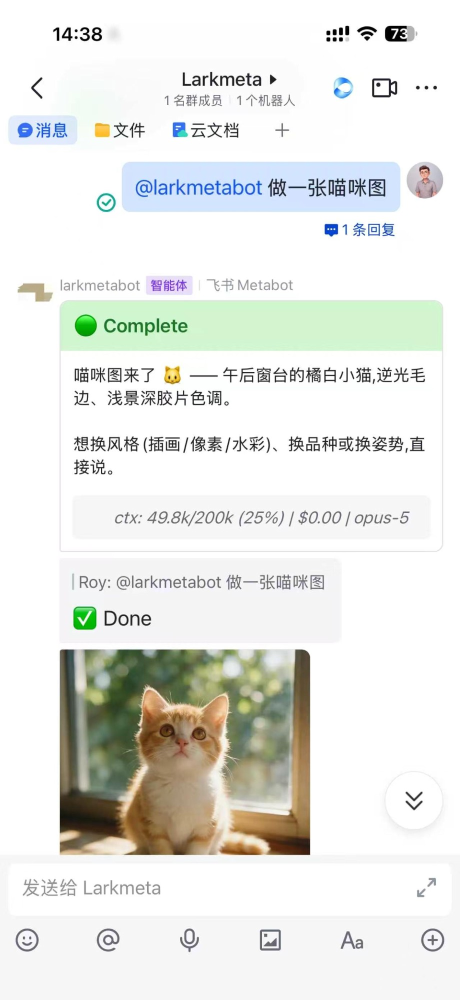
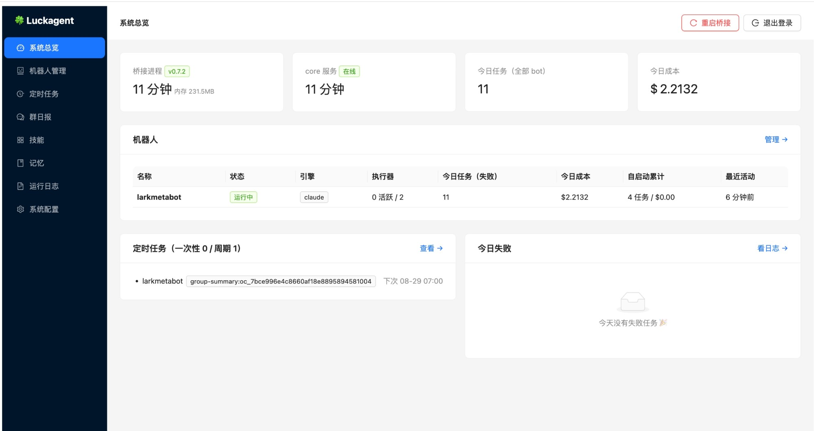

<p align="center">
  
</p>

<h1 align="center">
  <picture>
    <source media="(prefers-color-scheme: dark)" srcset="docs/images/logo-lockup-dark.png">
    
  </picture>
</h1>

<h3 align="center">
  让你的同事/伙伴与当前最强的模型在飞书群内协同工作，<br>
  不仅只是提升效率与交付质量，更是企业核心能力的沉淀。
</h3>

把飞书群聊接到 AI agent 引擎的自托管机器人平台。每个飞书机器人背后是一个完整的 agent 引擎——Claude Code（`@anthropic-ai/claude-agent-sdk` / Claude Code CLI），或指向 DeepSeek / MiniMax 官方 Anthropic 兼容端点的同一运行时——在各自独立的工作目录里拥有完整的工具权限：读写文件、跑命令、调 API、收发聊天附件。你在群里 @机器人说一句话，它就在你自己的 Mac 上替你干活，并把过程与产物以卡片形式实时回贴到群里。

> 本项目基于 [MetaBot](https://xvirobotics.com/metabot/) 构建（见文末[致谢与来源](#致谢与来源)）。

## 界面一览

<table>
  <tr>
    <td width="34%" align="center"><b>飞书端</b>——群里 @bot 一句话派活</td>
    <td width="66%" align="center"><b>Web 管理台</b>——<code>localhost:9100/admin</code></td>
  </tr>
  <tr>
    <td valign="top"></td>
    <td valign="top"></td>
  </tr>
</table>

左：@机器人说「做一张喵咪图」，bot 跑完贴出 Complete 卡片（页脚是真实的上下文用量 / 费用 / 服役模型），生成的图片直接发进群。右：管理台系统总览——桥接与 core 进程状态、今日任务数与成本、每个 bot 的引擎与执行器状态、定时任务（图中是一条群日报）。

## 项目目标

- **把 agent 从终端搬进团队日常沟通的地方。** Claude Code 这类 agent 很强，但入口是本机终端、一人一会话。Luckagent 让它以飞书机器人的身份 7×24 常驻：团队任何人在群里 @它 就能派活，产物（PPT、表格、文档、图片、视频、代码、语音）直接回到群里。
- **完全自托管、数据不出自己机器。** 跑在你的 Mac mini / MacBook 上：飞书凭证、聊天记录、工作文件、API key 都留在本机；对外只有到飞书开放平台的 websocket 长连接和你选择的模型 API。两个服务端口默认只绑 `127.0.0.1`。
- **多 bot、多引擎、一份配置。** 一台机器跑任意多个机器人，每个 bot 独立的飞书应用、工作目录、引擎（Claude / DeepSeek / MiniMax）与预算限额，适合「一个项目一个 bot 同事」的用法。
- **生产可靠优先。** 本项目源自一套在真实团队里连续运行数月的飞书 bot 集群，消息合并、附件收发、发送目录清理、引用上下文注入、空闲会话自动换新、记忆库出站闸门等 18 项行为增强都是实际踩坑后的沉淀（见[设计笔记](docs/design-notes.md)），并配有上千条自动化测试，每次提交都在 CI 上跑全量。

## 真实团队里，bot 每天在做什么

下面是一个真实团队（18 个项目 bot，一周近千个任务）里最常见的五类用法，客户、品牌与人名均已隐去：

| 场景 | 群里这样说（示例） | bot 交付什么 |
| --- | --- | --- |
| **营销视觉与电商图** | 「按第一张图的风格，把后面几张礼盒图做成一套场景图，礼盒上的字别动」→「把花去掉」「调成手机实拍感」 | 一套风格统一的场景图，产品外观与包装文字保持不变；群里一句话一轮，逐步微调到定稿 |
| **方案与提案** | 「根据会议纪要和我的 flow，出 5–6 页 social plan」「按客户批注改一版 V2 视频框架，另存新链接，改动处高亮」 | 可编辑的 PPT、飞书文档；改稿保留旧版、标出改动，方便负责人快速复核 |
| **数据周报与诊断** | 「填本周私域周数据，去掉某渠道的数据，列出有反馈的用户」「这天的首回平均时长为什么是 46 分钟？」 | 飞书云表格与多维表格，附数据口径说明和结论；异常值会追到原始记录找原因 |
| **文案与沟通** | 「写一版中秋国庆的社群关怀文案」「把给客户的反馈改得委婉具体，别用主观批判的词」 | 节日文案、直播串词、促销短句、对外沟通稿，按指定调性一次给出多个备选 |
| **定时自动化** | 每天早上自动跑：群聊总结、行业新闻简报、合同巡检与月度收入确认、人事关键节点提醒、服务到期预警 | 无需人叫：定时读写多维表格 / 云文档，结果发回对应的群；涉及金额等敏感数据只留本地 |

这些产出都直接回到群里，团队的每一次纠偏（「字体不对」「格式按上月的保持」）都会沉淀进 bot 的记忆，需要跨 bot 共用的再存进共享知识库——下次不用再说一遍，这正是「能力沉淀」的来源。

## 架构

两个常驻进程，由 PM2 管理：

```
                       ┌──────────────────────────────────────────────┐
  飞书开放平台          │  luckagent-bridge          (127.0.0.1:9100)  │
  ┌──────────┐  长连接  │  ┌────────────┐   ┌───────────────────────┐  │
  │ 飞书应用 A │◄───────►│  │ Bot A 桥接  │──►│ 引擎: Claude Code     │  │
  │ 飞书应用 B │◄───────►│  │ Bot B 桥接  │──►│  / DeepSeek / MiniMax │  │
  │   ...    │ websocket│  │   ...      │   │ (每 bot 独立工作目录)   │  │
  └──────────┘          │  └────────────┘   └───────────────────────┘  │
                        │  HTTP API (Bearer)  +  Web 管理台 /admin      │
                        └──────────────┬───────────────────────────────┘
                                       │
        luckagent CLI ─────────────────┤ :9100  (bots/talk/schedule/…)
        (~/.local/bin)                 │
                                       ▼
                        ┌──────────────────────────────────────────────┐
                        │  luckagent-core            (127.0.0.1:9200)  │
                        │  共享记忆 / 技能中心 / Agent 总线 / 收件箱     │
                        │  SQLite: ~/.luckagent-core/data/central.db   │
                        └──────────────────────────────────────────────┘
```

- **luckagent-bridge**：通过 websocket 长连接接入每个配置的飞书应用，驱动 agent 引擎跑任务，同时暴露 HTTP API（`API_SECRET` Bearer 鉴权）并托管 Web 管理台 `http://localhost:9100/admin`。
- **luckagent-core**：中央存储服务——跨 bot 共享记忆、技能注册中心、agent 地址簿与 CLI 收件箱，token 由 `central-admin` 签发。
- **luckagent CLI**：单一命令行入口，覆盖进程管理、bridge API 与 core 功能三类命令。

两个端口默认都只绑 `127.0.0.1`，不额外配置不会暴露到网络。

### 一条消息的生命周期

1. **接收**：飞书事件经 websocket 长连接推到 bridge（无需公网回调地址）；快速连发的多条消息会自动合并成一轮。@bot 触发时按飞书接口拉取这个人上一次 @ 之后发的材料（文本、链接、图片、文件）一并带上，支持「先发材料、最后 @」的用法；断连重连后会补扫盲区消息。
2. **会话**：每个聊天（群/私聊）对应一个持续的 agent 会话——各引擎默认走**持久执行器池**（长驻进程，支持 Agent Teams、`/goal` 多轮自动推进、后台任务），其余引擎逐回合拉起。会话空闲 3 小时以上且经历过上下文压缩时自动开新会话，并把旧会话最近的交接摘要注入首条提示词，避免会话文件无限膨胀、压缩随机砸在任务中间。
3. **执行**：引擎在该 bot 的独立工作目录（默认 `~/projects/<bot名>`，根目录安装时可改）里全工具运行；聊天里发的文件自动下载到 `inputs/` 供 agent 直接使用。装机即备好办公与媒体工具链（python-pptx / openpyxl / Pillow 等 Python 基础包、LibreOffice、ffmpeg、poppler、Noto CJK 字体），做 PPT、表格、文档、PDF、图片、语音不用临时装环境。
4. **回贴**：过程流式更新到飞书卡片；agent 放进发送暂存目录的产物**发过即删**，回合结束再补扫一次防漏发（归档另存 `outputs/`）。
5. **管控**：预算限额、并发上限、群聊白名单、私聊是否也需 @、`/model` 会话内切引擎等都按 bot 配置；全机默认引擎 / 模型 / 生图后端在管理台「系统配置」里改；全程记账可在管理台与 `luckagent stats` 查看。回合因故起不来（比如执行器拉起失败）时，卡片会收成错误态并写明原因，不会一直转圈。

## 特性

- **多 bot 单进程**：一份 `bots.json` 配任意多个飞书机器人，各自独立的应用凭证、工作目录、引擎与预算限额。
- **多引擎可选**：每个 bot 用 `engine: "claude" | "deepseek" | "minimax"` 选择后端；Claude 支持 API key 或订阅登录，DeepSeek / MiniMax 走各家官方 Anthropic 兼容端点、只要 key 零安装（均支持看图）。所有引擎共享同一 Claude Code 运行时——持久会话、Agent Teams、记忆体系完全一致。全机默认引擎与各引擎默认模型可在管理台直接改，单个 bot 仍可单独覆盖。
- **Web 管理台**：系统总览、机器人管理（含手把手的飞书接入向导，列表显示每个 bot 实际生效的模型）、定时任务、群日报、技能与记忆、运行日志、系统配置（默认引擎 / 模型 / 生图后端可编辑，保存后确认即重启生效），浏览器里完成从建应用到跑通的全流程。
- **定时任务与群日报**：一次性延迟与 cron 周期任务，CLI / 管理台 / HTTP API 三种入口，持久化、重启自动恢复；群日报按群名一键开关，默认每天早 7 点总结昨天全天。
- **生产磨出来的稳定性**（详见 [设计笔记](docs/design-notes.md)）：文件上传超时重试、快速连发消息合并、群聊引用回复精确通知、被引消息上下文注入、@ 时按接口拉本轮材料、空闲会话自动换新并交接、出站内容脱敏、记忆库出站闸门、发送目录「发过即删 + 漏发补扫」、超大附件分片下载、长连接断连补扫、发送失败明确告知等，全部内建。
- **跨 bot 协作**：共享记忆沉淀知识、技能中心复用方法、agent 总线让 bot 之间互相委托任务，也支持跨主机 peers 联邦。
- **办公与媒体工具链**：安装脚本一次装齐 bot 产出所需的 Python 基础包（python-pptx / openpyxl / Pillow / pandas / PyMuPDF 等，独立 venv 不碰系统 Python）、LibreOffice、ffmpeg、poppler 与 Noto CJK 字体；`luckagent doctor` 可检查是否齐全。
- **生图与视频**：生图有 ChatGPT 订阅就走本机 Codex CLI 内置的生图（不需要 API key），没有订阅用火山 Seedream，Codex 未登录或撞订阅额度时自动改用 Seedream；视频用火山 Seedance（文生视频、首帧图生视频、参考图 / 视频 / 音频），与 Seedream 共用一把火山方舟 key。用群里发来的视频 / 音频当参考素材时需要可选的火山 TOS，素材用完自动删除。安装脚本会代装 Codex 并引导登录、询问火山 key，之后在管理台随时切换或补填。
- **语音**：文本转语音（豆包 / OpenAI / ElevenLabs / Edge TTS），可配置语音回复。

## 系统要求

- **macOS**（目标机型 Mac mini / MacBook，Apple Silicon）；安装脚本会自动补齐 Homebrew、node 22、PM2、lark-cli，以及办公与媒体工具链（ffmpeg / LibreOffice / poppler / Noto CJK 字体 / Python 基础包）
- 一个**飞书企业自建应用**（安装后管理台的「接入向导」会手把手带你创建，或先看[配置指南](docs/feishu-app-setup.md)）
- 至少一种**引擎认证**：Claude 订阅登录或 `ANTHROPIC_API_KEY`；或 DeepSeek / MiniMax 的 API key（`DEEPSEEK_API_KEY` / `MINIMAX_API_KEY`，零 CLI 安装）。详见[引擎配置](docs/engines.md)
- 生图 / 视频（可选）：生图用 ChatGPT 订阅（走 Codex CLI，安装脚本代装）或火山方舟 `ARK_API_KEY`；视频需要火山方舟 `ARK_API_KEY`；参考本地视频 / 音频再加火山 TOS

## 安装

两种方式，装完效果相同（推荐方式 A）：

**方式 A · 一行命令（推荐，零前置依赖）**

```bash
curl -fsSL https://raw.githubusercontent.com/haoyan-yam/luckagent/main/scripts/get.sh | bash
```

只用 macOS 自带的 curl/tar/bash——全新机器（没有 Node、没有 git）也能直接跑。脚本把仓库取到 `~/luckagent` 后转交交互式 install.sh；重复执行安全（检测到现有安装会给升级指引）。想先看脚本内容：[scripts/get.sh](scripts/get.sh)。可用 `LUCKAGENT_DIR` / `LUCKAGENT_YES=1` 等环境变量定制，见脚本头部注释。

> 机器上已有 Node 的话，`npx luckagent init` 效果相同。

**方式 B · git clone**

```bash
git clone https://github.com/haoyan-yam/luckagent.git ~/luckagent
cd ~/luckagent && bash install.sh
```

git 检出天然支持 `luckagent update` 一键升级。

安装过程中会依次询问：**默认引擎与认证**、**生图与视频**（有 ChatGPT 订阅就代装 Codex 并登录；火山方舟 key 用于视频和 Seedream 生图；可选配 TOS）、**bot 工作区根目录**（默认 `~/projects`）。都可以直接回车用默认值，之后在 `.env` 或管理台里改。

安装完成后：

1. 打开管理台 `http://localhost:9100/admin`（登录密钥是 `.env` 里的 `API_SECRET`）；
2. 在「机器人管理 → 接入向导」里创建飞书应用并保存第一个机器人（也可以先看[飞书应用配置指南](docs/feishu-app-setup.md)）；
3. 重启桥接进程使配置生效：`luckagent restart`；
4. 在飞书里搜到机器人，发一句话测试。

安装细节（依赖、目录选择、PM2 自启等）见 [INSTALL.md](INSTALL.md)。

## 命令速查

```bash
# 进程管理
luckagent start                 # 用 PM2 启动 bridge + core
luckagent restart [--core|--all]# 重启（默认只重启 bridge）
luckagent stop [--core|--all]   # 停止
luckagent logs [--core]         # 看实时日志
luckagent status                # PM2 进程状态
luckagent update                # git pull + 重装依赖 + 构建 + 同步技能 + 重启
luckagent doctor [--json]       # 本机运行时诊断

# 桥接 API（localhost:9100）
luckagent bots                  # 列出所有 bot（本机 + peers）
luckagent talk <bot> <chatId> "<任务>"          # 让某个 bot 干活
luckagent schedule cron <bot> <chatId> '0 9 * * 1-5' "<提示词>"  # 定时任务
luckagent stats                 # 费用与用量统计
luckagent voice tts "你好" --play  # 文本转语音
luckagent health                # 健康检查

# 中央服务（localhost:9200）
luckagent memory search "<关键词>"   # 搜共享记忆
luckagent memory create "<标题>" "<内容>"
luckagent skills list | install <name>
luckagent agents list           # peer bot 地址簿
luckagent inbox poll            # CLI agent 收件箱
```

完整命令与参数见 [CLI 参考](docs/cli-reference.md)。

## 升级

| 安装方式 | 升级命令 |
| --- | --- |
| git 检出（git clone / 一行命令在有 git 的机器上） | `luckagent update`（git pull + 重装依赖 + 构建 + 同步技能 + 重启） |
| 无 `.git` 的安装（一行命令在裸机上的 tarball 下载模式） | `curl -fsSL https://codeload.github.com/haoyan-yam/luckagent/tar.gz/refs/heads/main \| tar -xz --strip-components=1 -C ~/luckagent`，然后重跑 `bash install.sh`（幂等） |

> 升级时留意：
> - **v0.7.9 起的办公与媒体工具链**（LibreOffice / ffmpeg / poppler / 字体 / Python venv）只由 `install.sh` 安装，`luckagent update` 不会补装。老机器升级后重跑一次 `bash install.sh`（幂等，只装缺的），或先跑 `luckagent doctor` 看 `office_media_toolchain` 一项。
> - **v0.7.13 起生图不再用 OpenAI API**：`OPENAI_IMAGE_API_KEY` 不再生效。只配了它的机器请 `npm i -g @openai/codex && codex login`，或在 `.env` 填 `ARK_API_KEY`，然后 `luckagent restart`；`luckagent doctor` 的 `image_gen` 一项会提示。
> - **v0.7.18 起内置视频生成技能 `seedance-video`**：`luckagent update` 会同步技能；在管理台「系统配置 → 默认设置 → 视频生成」填火山方舟 key（生图已用 Seedream 的机器共用现有 key，不用再填）即可开通。
> - **v0.7.17 起 bot 工作区根目录可自定义**，但只在安装时询问。老机器沿用 `~/projects`；要换位置就在 `.env` 加一行 `LUCKAGENT_PROJECTS_DIR=<路径>` 再 `luckagent restart`（只影响之后新建的 bot）。

## 文档

| 文档 | 内容 |
| --- | --- |
| [飞书应用配置指南](docs/feishu-app-setup.md) | 在飞书开放平台建应用、配权限、订阅事件、发布上线的逐步引导 |
| [引擎配置](docs/engines.md) | Claude / DeepSeek / MiniMax 各引擎的认证路线、切换方式，以及在管理台改全局默认引擎与模型 |
| [目录结构](docs/directory-layout.md) | 安装目录、每 bot 工作目录约定、⚠️ 归档目录与发送暂存目录的关键区别、状态目录与日志位置 |
| [定时任务](docs/scheduling.md) | CLI / 管理台 / HTTP API 三种入口，cron 与时区，暂停恢复 |
| [技能体系](docs/claude-code-skills.md) | 随装与可选技能、技能发现机制、工作区两级指令模板 |
| [CLI 参考](docs/cli-reference.md) | `luckagent` 全命令的用途与示例 |
| [管理台使用手册](docs/admin-console.md) | 各页面说明（含群日报）、机器人增删改流程、重启语义、安全说明 |
| [更新日志](CHANGELOG.md) | 各版本变更；版本号即管理台总览页所示 |
| [设计笔记](docs/design-notes.md) | 18 项内建行为增强（代号 A–U）的行为说明、开关与设计取舍 |
| [常见问题排查](docs/troubleshooting.md) | 端口占用、代理变量坑、启动失败、卡片报「启动任务失败」或空白、生图 / 视频失败、管理台打不开等 |

## 安全提示

- bridge 与 core 默认只监听 `127.0.0.1`；把 `LUCKAGENT_API_HOST` 设为 `0.0.0.0` 之前请务必读[管理台使用手册的安全一节](docs/admin-console.md#安全说明)。
- `.env` 与 `bots.json` 含密钥，安装脚本会将其权限设为 600，请勿提交进版本库。

## 致谢与来源

Luckagent 基于 **[MetaBot](https://xvirobotics.com/metabot/)** 构建——在其飞书桥接与多引擎
架构之上，融入数月真实 bot 集群运行沉淀的行为增强与可靠性修复，脱敏重构而来。
感谢原项目作者的工作。

## License

MIT（含 MetaBot 的双版权声明），见 [LICENSE](LICENSE)。
